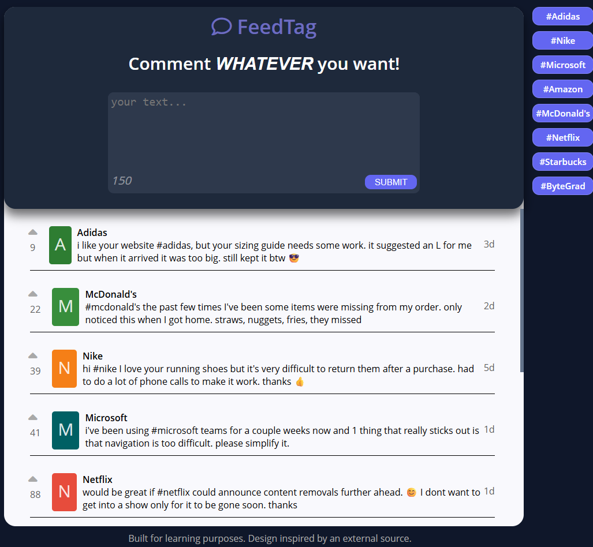

# FeedTag 💬

A responsive feedback web app where users can submit comments mentioning companies via hashtags, vote on feedback, and filter comments by company.

---

## Features

* 📝 Submit feedback with a required `#company` hashtag
* ✅ Input validation with visual feedback
* ⌨️ Live character counter (150-character limit)
* 💾 Submit new feedback via a REST API
* 🔄 Load feedback from a REST API
* 🎨 Random badge color for each comment
* 🔼 Upvote system for feedback items
* 🏷️ Dynamic hashtag generation and filtering
* 📱 Responsive layout with a mobile burger menu
* 📖 Expand long comments on mobile
* ⏳ Loading indicator while fetching feedback
* 🎛️ Custom scrollbar for the feedback section

---

## Tech Stack

* HTML5
* CSS3 (Flexbox, animations, responsive design)
* JavaScript (ES6+)

  * Fetch API (GET & POST)
  * DOM Manipulation
  * Event Delegation
  * Template Literals

---

## Live Demo

[View on GitHub Pages](https://kiawnoosh.github.io/portfolio-projects/frontend/feedtag/)

---

Built for learning purposes. Design inspired by an external source.
